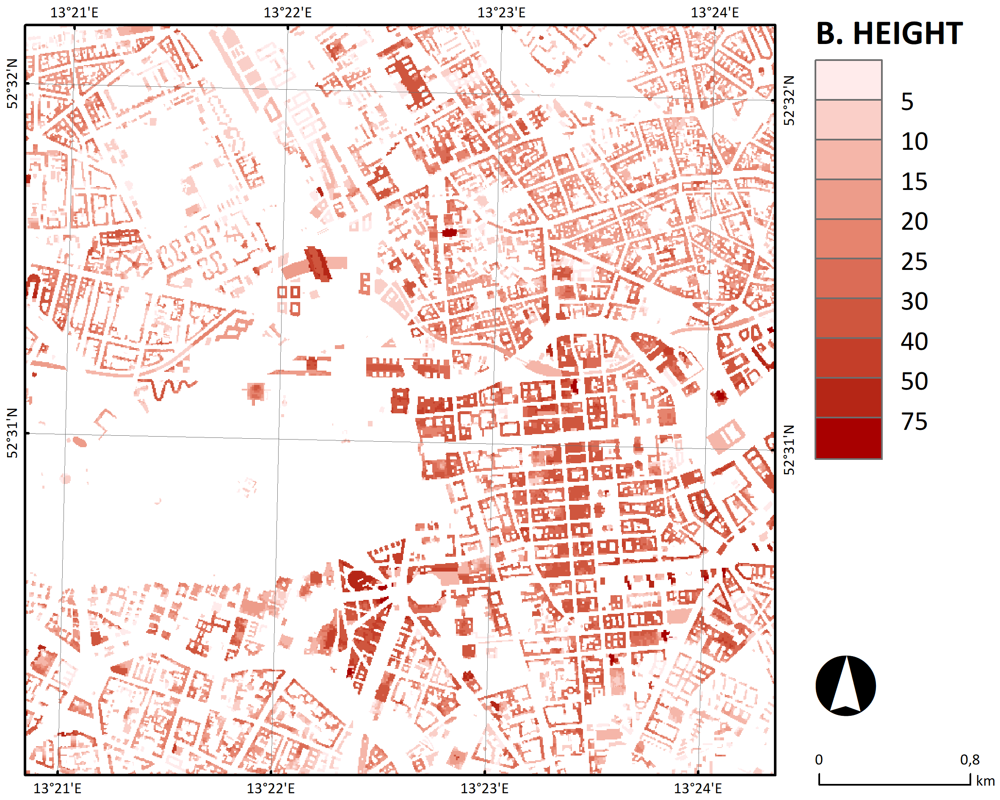
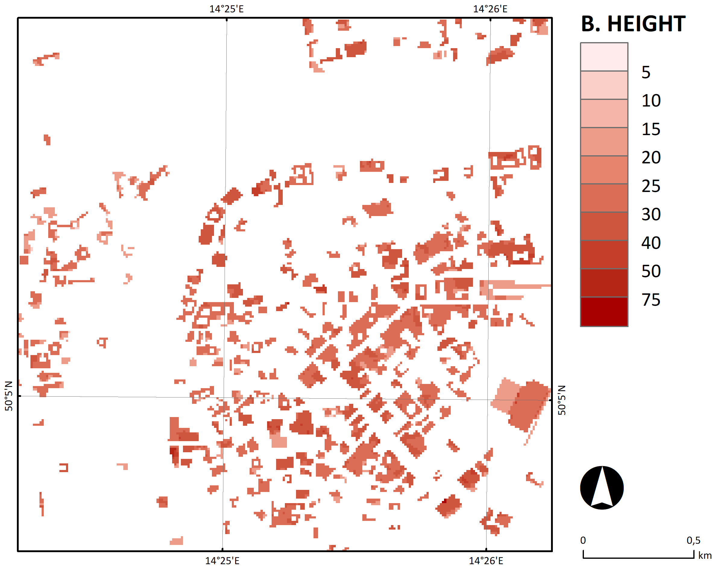

PALM-GeM
=============================================================
**PALM-GeM** (Geospatial Data Merging and preprocessing into PALM) is an advance tool for PALM's *static driver* preparation. PALM-GeM is developed to work effectively with publicly available dataset in standard GIS format. The enables to prepare a *static driver* for most larger european cities in spatial resolution 5-10m. Current data sources are UrbanAtlas, OpenStreepMap, EU-DEM

## Functionality
The workflow of *static driver* preparation:
- **Location definition**: definition of simulation domain. Checking data availability for selected region/city. 
- **Dataset downloading**: download of necessary dataset.
- **Domain definition for inputs**: definition of domain extend for general inputs domain schema.
- **Inputs data preparation**: Geographic conversion to unified targed Geographic coordinate reference system (EPSG, SRID)
- **PALM static driver domain definition & preparation**: Detailed definition of target PALM's *static driver* domain. Domain center, extend, resolution, ...

## Opensource PALM Static Driver preprocessor
Short paragraph about tool
* All mayor cities in Europe are there
* Note about how user can prepare static driver for every bigger european city and with other PALM tools (WRF interface, PROMET, PALM itself) can run PALM simulation with reasonable good resolution.

## Installation
Detailed installation can be found here: [Installation](docs/install.md)

## Documentation
General description of used modules, function etc.. [docs](docs/general.md) \
Detailed list of all available configuration are listed here: [configuration list](docs/configuration_docs.md) \
Running preprocessor python script and its configuration is documented here: [preprocesor run](docs/run_preprocessor.md) \
The main run of static driver generator with its configuration is documented here: [static driver generator](docs/run_palm_static_driver.md)
[Tutorial](docs/visuallization.md) how to connection PostgreSQL database with QGIS application and enable interactive visualization.
Brief description of cut cell topography - slanted faces is documented here: [cut cell topography](docs/cut_cell_topo.md) \
Buildings 3D, Brief description of processing of buildings 3d are shown [HERE](docs/buildings_3d.md)
LOD2 input for detailed parameterization of surfaces is documented [HERE](docs/lod2.md)

## Contributing / Support
If you wish to use your own dataset with more detailed parameterization, please contact us. We will gladly help with implementation.

## Change log
Current version developed to process open-source datase (UrbanAtlas, OpenStreetMaps).
2024.03.19 - This is an initial commit, more details will be added later.

## Example
We have prepared several example testcases \
[Berlin testcase](examples/berlin/README.md) \
[Prague testcase](examples/prague/README.md) \
[Brno testcase](examples/brno/README.md) \
[Bergen testcase](examples/bergen/README.md)

## Benchmark
| Domain | Size [km x km] | Grid size | Time [h] |
|:------------------|:---------------|:---------------|:----------|
| Brno | 0.640 x 0.640 | 64 x 64 | 12 [s] |
| Brno | 1.280 x 1.280 | 128 x 128 | 23 [s] |
| Brno | 2.560 x 2.560 | 256 x 256 | 117 [s] |
| Brno | 5.120 x 5.120 | 512 x 512 | 14.3 [min] |
| Brno | 10.240 x 10.240 | 1024 x 1024 |  [min] |
| Brno | 20.480 x 20.480 | 2048 x 2048 |  [min] |
| Brno | 40.960 x 40.960 | 4096 x 4096 |  [min] |
| Prague |  x  |  x  |  [min] |
| Bergen | 0.640 x 0.64 | 64 x 64 |  88 [s] |
| Bergen | 1.280 x 1.280 | 128 x 128 | 100  [s] |
| Bergen | 2.560 x 2.560 | 256 x 256 | 155 [s] |
| Bergen | 5.120 x 5.120 | 512 x 512 | 11 [min] |
| Bergen | 10.240 x 10.240 | 1024 x 1024 |  [min] |
| Bergen | 20.480 x 20.480 | 2048 x 2048 | 20 [h] |
| Berlin | 0.320 x 0.320 | 64 x 64 | 13 [s] |
| Berlin | 0.640 x 0.640 | 128 x 128 | 134 [s] |
| Berlin | 1.280 x 1.280 | 256 x 256 | 123 [s] |
| Berlin | 2.560 x 2.560 | 512 x 512 | 30 [min] |
| Berlin | 4.000 x 4.000 | 800 x 800 | 67 [min] |

## Example static driver
|                                                       |                  Grid cell type                  |                 Terrain height                  |                 Buiding height                 |
|:-----------------------------------------------------:|:------------------------------------------------:|:-----------------------------------------------:|:----------------------------------------------:|
|     Berlin   4000 x 4000 m   5m resolution      |        |   |   |
|     Prague   2560 x 2560 m   10m resolution     |         |    |    |
|      Brno   5120 x 5120 m   10m resolution      |            |       |       |
|   Bergen   10 240 x 10 240 m   10m resolution   |        |   |                       .                        |

## Project status & Future versions
Currently, we are able to produce PALM's static driver for most of the larger cities in EU. We have developed (in testing branch: cut-cell-topo) an extension for cut cell topography (link to PALM CCT or article). The cut cell tool is under development, but the version is working in most cases. There is an extension under development that would process finer geospatial datasets into PALM finer parametrization (vegetation pars, building pars, building surface pars, etc.). This extension would also process individual trees location into LAD (leaf area density) variable. Examples of this extensions can be found: cite our work. The extension will be soon part of main branch in PALM-GEM.

## License
PALM-GeM is distributed under the GNU GPL v3+ license (see the `LICENSE` file).
It was created by the Institute of Computer Science of the Czech Academy of
Sciences (ICS CAS).

## Authors
List of authors with contacts.

## Cite us