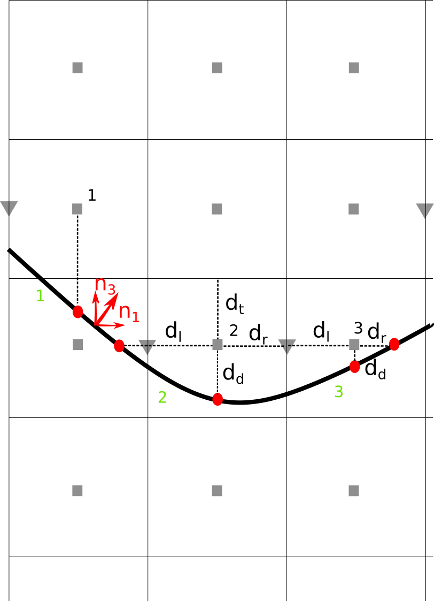
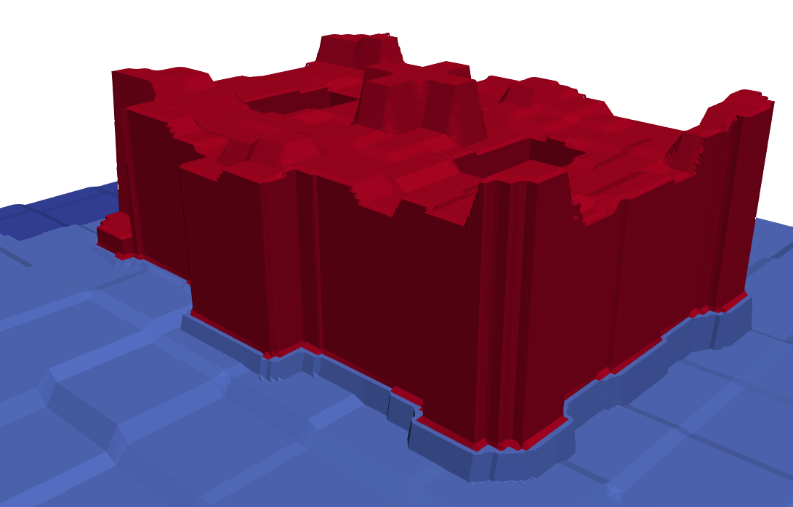

# Cut Cell Topography - Slanted surface PALM extension
A more comprehensive model description is currently under preparation and will be publicly available as a peer-reviewed journal article in the future.
## Surface representation
The implementation of a cut-cell topography into PALM is primarily motivated in terms of an accurate representation of the surface energy balance. This compasses geometrical information about the surface such as the coordinates of the mass center (*cct_face_center*), the normal vector (*cct_face_normal_vector*), the surface area per grid cell (*cct_face_area*), the vertices cutting the edges of a grid box (*cct_vertices_per_face*) as well as the corresponding grid indices in the numerical grid where the cut-cell surface is located (*cct_3d_grid_indices*, ordered $k,j,i$). Further on, for each cut-cell surface its general classification is required given by *cct_surface_type_classification* (natural-type: 0, building wall: 1, building roof: 2, default-type: 3). To further classify the cut-cell surface, information about its *cct_vegetation_type_classification*, *cct_water_type_classification*, *cct_pavement_type_classification*, *cct_building_type_classification* and its *cct_building_id_classification* needs to be given.\

The algorithm slightly modifies building and surface polygons to meet the condition “one cut cell per grid cell” and assures a watertight surface envelope. Essential properties are calculated such as the polygon center, normalized normal vector, area, coordinate system for radiation module and indexed coordinates of vertices. Since not all polygon vertices do lie in plane and curved surfaces can occur, the area and normal vector are calculated using a tessellation approach. The cut-cell surface area is the sum of all triangles and the normal vector is an area weighted average from the triangle normal vector.\
In the last step all polygons are checked for their “water-tight” property.

Illustration of the topography representation in a Cartesian framework. The thick black line indicates the step-like approximation of the topography surface in the Cartesian framework. The gray squares indicate the grid point center, while the red dots indicate the location of the surface. \

Example visualization of cut cell topology representation of Reichtag, Berlin. 256m x 256m in 1m resolution. \

## Data processing
Detailed description of data processing can be found in upcomming publication.